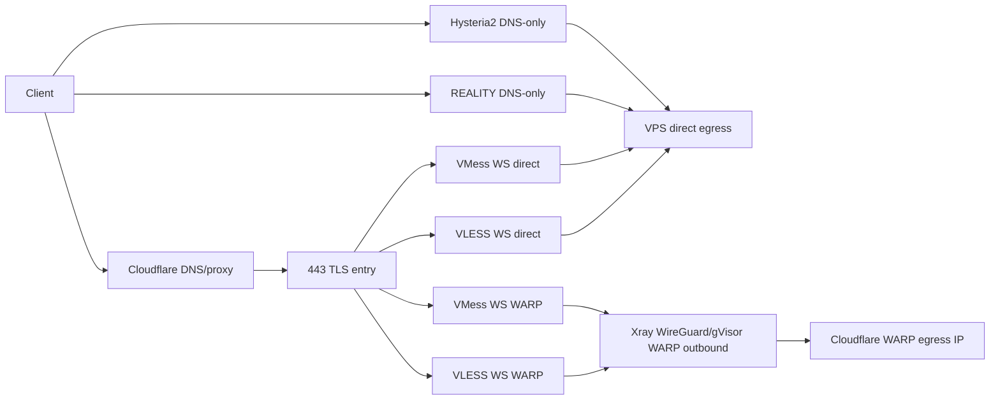

# Route map and use cases

## Target topology

## Protocol mapping

| Family | Typical hostname | Transport | DNS mode | Egress | Best use |
|---|---|---|---|---|---|
| VLESS WS direct | `us2.<root>` | TLS + WebSocket | Orange cloud | VPS IP | Broad compatibility and CDN-fronted fallback |
| VMess WS direct | `us2.<root>` | TLS + WebSocket | Orange cloud | VPS IP | Legacy clients and VMess-only environments |
| VLESS REALITY | `us2r.<root>` | REALITY over TCP/XHTTP as generated | DNS-only | VPS IP | No certificate issuance and balanced speed/obfuscation |
| Hysteria2 | `us2h2.<root>` | QUIC/UDP + TLS | DNS-only | VPS IP | Video, high throughput, lossy links |
| VLESS WS WARP | `us2.<root>` + WARP path | TLS + WebSocket | Orange cloud | WARP IP | WARP clean exit with existing WSS appearance |
| VMess WS WARP | `us2.<root>` + WARP path | TLS + WebSocket | Orange cloud | WARP IP | Same WARP egress for legacy VMess clients |

The exact host labels, ports, paths, tags, and core are variables. Discover them from the live configuration and the current upstream script rather than assuming the example values.

## Current-node example

The observed node used the following logical mapping. Treat it as a reference, not a universal default:

| Node | Path/port | Route |
|---|---|---|
| VLESS WS | `/example-vless-ws` through 443 fallback | `z_direct_outbound` |
| VMess WS | `/example-vmess-ws` through 443 fallback | `z_direct_outbound` |
| VLESS WS WARP | `/example-vless-ws-warp` through 443 fallback | `wireguard_out_IPv4` |
| VMess WS WARP | `/example-vmess-ws-warp` through 443 fallback | `wireguard_out_IPv4` |
| Hysteria2 | UDP port selected by agent | direct unless separately routed |

A VLESS link must use the VLESS path, and a VMess link must use the VMess path. A leading slash must occur exactly once in the effective WebSocket path. URI percent encoding belongs to the URI layer; do not place a literal `%2F` in a decoded VMess JSON profile.

## Cloudflare behavior

The orange cloud terminates/proxies the WSS front door and can pass WebSocket traffic to the 443 fallback. It does not turn a WSS inbound into a WARP exit. The WARP exit is selected after Xray has authenticated the inbound and applied an inbound-tag routing rule.

For the Xray userspace WARP topology, the WireGuard outbound must select gVisor/netstack explicitly with the installed schema's `noKernelTun` setting. Seeing a request route to the WireGuard tag is not proof that the tunnel is healthy; first verify the isolated outbound reports `warp=on`, then verify both cloned WS inbounds do the same.

The gray-cloud REALITY and Hysteria2 names expose the VPS directly. Hysteria2 especially requires direct UDP reachability and a certificate matching its SNI. A wildcard certificate such as `*.example.com` covers `us2h2.example.com` only if the certificate SAN actually contains the wildcard.

The direct VPS may prefer IPv6 while the WARP outbound is IPv4-only. Direct tests may therefore report either VPS address family, but IPv4 WARP tests must force an IPv4 destination so the result measures the configured tunnel rather than an unrelated IPv6 path.
